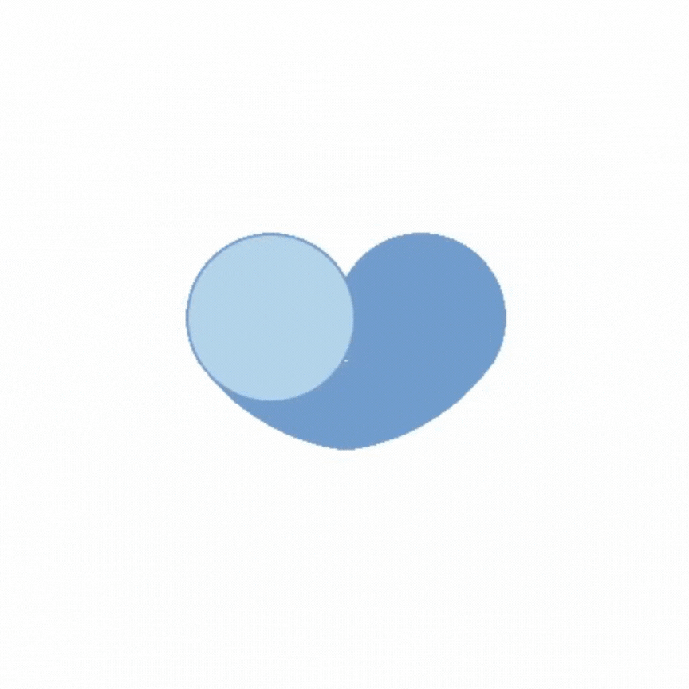

# 30 dias com CSS!
 Olá! Estou começando o desafio 30 dias de CSS para praticar e adiquirir conhecimentos.
 O desafio consiste em fazer um mini projeto por dia utilizando HTML e CSS durante 30 dias.

 Referências usadas: [CodingNepal](https://www.youtube.com/@CodingNepal)

 ## Regras
 
 + Realizar um projeto por dia;
 + Adicionar o código do projeto no GitHub;
 + Compartilhar o seu progresso nas mídias sociais (LinkedIn, Twitter, Facebook...) usando a hashtag #30diasDeCSS,
 + O projeto deve ser concluído até as 23:59;

## Dia 1 - Barra de progresso circular

  

### O que eu aprendi e utilizei

+ CSS animation
+ CSS @keyframes
+ Transform
+ z-index

## Dia 2 - Mudança de cor

  

### O que aprendi e utilizei

+ CSS Animation
+ CSS Filter - Hue rotate
+ CSS @keyframes

## Dia 3 - Botão com efeito

  

### O que aprendi e utilizei

+ Before
+ Hover
+ Transições

## Dia 4 - Efeito texto brilhando

  

### O que aprendi e utilizei

+ Animações CSS
+ Nth-of-type
+ Text-shadow

## Dia 5 - Efeito pulsar

  

### O que aprendi e utilizei

+ Animações CSS
+ Transform

## Dia 6 - texto esfumaçado

  

### O que aprendi e utilizei

+ Filter blur
+ Rotate e translate
+ Transição e delay

## Dia 7 - Pendulo de Newton

  

### O que aprendi e utilizei

+ Animação CSS
+ Before
+ Fist-child
+ Last-child

## Dia 8 - Efeito máquina de escrever

  

### O que aprendi e utilizei

+ Animação CSS
+ Overflow
+ White-space

## Dia 9 - Ícones com efeito

  

### O que aprendi e utilizei

+ After/before
+ Animação CSS
+ Hover

## Dia 10 - Checkbox de coração

  

### O que aprendi e utilizei

+ After e before
+ Input:checked
+ Radial gradient
+ Transform translate

## Dia 11 -Ícone de mídia social em camadas

  

### O que aprendi e utilizei

+ Camadas
+ Hover
+ Nth-child
+ Transcições
+ Transform

## Dia 12 - Texto com gradiente animado

  

### O que aprendi e utilizei

+ Animação CSS
+ Background-clip
+ Linear-gradient
+ Text fill color

## Dia 13 - Menu com efeito hover

  

### O que aprendi e utilizei

+ After e before
+ Hover
+ Transform scale
+ Transition

## Dia 14 - Preloader animado

  

### O que aprendi e utilizei

+ Animations
+ Nth-child ()

## Dia 15 - Efeito de preenchimento com hover

  

### O que aprendi e utilizei

+ Before
+ Hover
+ Overflow hidden
+ Transotions
+ Webkit text stroke

## Dia 16 - Loading com efeito

  

### O que aprendi e utilizei

+ Animations
+ Nth-child ()
